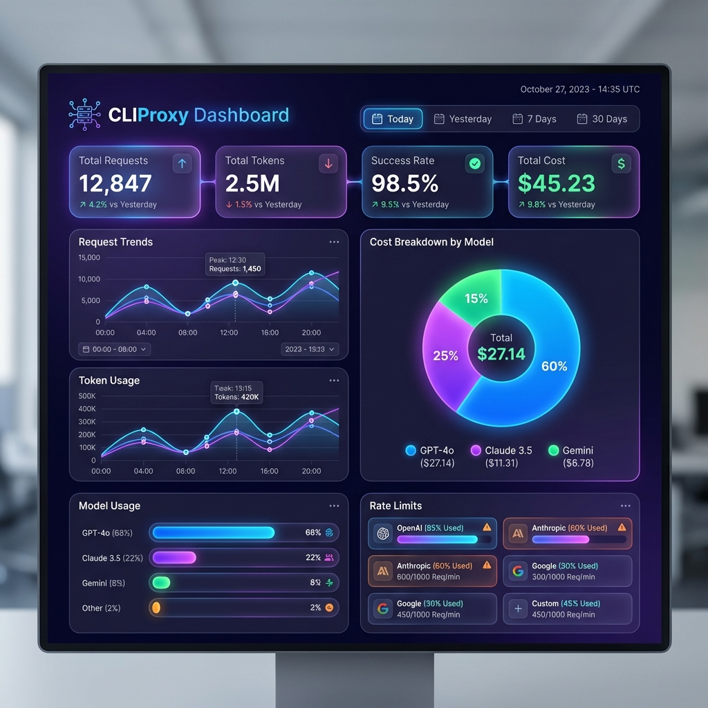
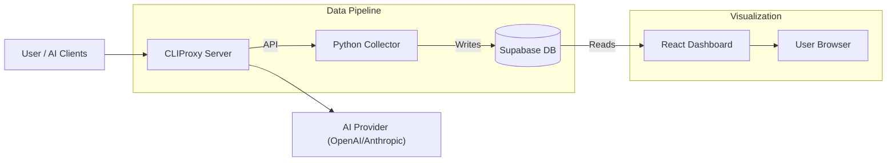

# CLIProxy Dashboard

🎛️ **Real-time monitoring dashboard for CLIProxy API usage** - Track requests, tokens, costs, and rate limits across all your AI models.


<p align="center">
  
</p>

## 📋 Overview

CLIProxy Dashboard collects usage data from your CLIProxy Management API, stores it in Supabase, and displays beautiful analytics with cost estimation.



## ✨ Features

- 📊 **Usage Analytics** - Track requests, tokens, success rates over time
- 💰 **Cost Estimation** - Calculate estimated API costs per model
- 🔄 **Date Range Filters** - View Today, Yesterday, 7 Days, 30 Days, or All Time
- 📈 **Hourly Breakdown** - See usage patterns throughout the day
- 🚦 **Rate Limit Tracking** - Monitor remaining quotas for each provider
- 🤖 **Model Breakdown** - Usage and cost per AI model

---

## 🚀 Quick Start

> **New users?** See [SETUP.md](SETUP.md) for a complete step-by-step guide!

### Prerequisites

- [Docker](https://docs.docker.com/get-docker/) & Docker Compose
- [Supabase](https://supabase.com) account (free tier works)
- CLIProxy running with Management API enabled

---

## 📦 Step 1: Set Up Supabase

### 1.1 Create a Supabase Project

1. Go to [supabase.com](https://supabase.com) and sign in
2. Click **New Project**
3. Choose your organization, name your project, and set a database password
4. Wait for project to be created (~2 minutes)

### 1.2 Create Database Tables

1. In your Supabase project, go to **SQL Editor** (left sidebar)
2. Click **New Query**
3. Copy and paste the following SQL:

```sql
-- ============================================
-- CLIProxy Dashboard Database Schema
-- ============================================

-- Table for storing raw usage snapshots
CREATE TABLE IF NOT EXISTS usage_snapshots (
    id BIGSERIAL PRIMARY KEY,
    collected_at TIMESTAMPTZ NOT NULL DEFAULT NOW(),
    total_requests INTEGER NOT NULL DEFAULT 0,
    success_count INTEGER NOT NULL DEFAULT 0,
    failure_count INTEGER NOT NULL DEFAULT 0,
    total_tokens BIGINT NOT NULL DEFAULT 0,
    cumulative_cost_usd DECIMAL(10, 6) DEFAULT 0,
    raw_data JSONB
);

-- Table for storing per-model usage data (granular snapshot details)
CREATE TABLE IF NOT EXISTS model_usage (
    id BIGSERIAL PRIMARY KEY,
    snapshot_id BIGINT REFERENCES usage_snapshots(id) ON DELETE CASCADE,
    api_endpoint VARCHAR(255) NOT NULL,
    model_name VARCHAR(255) NOT NULL,
    request_count INTEGER NOT NULL DEFAULT 0,
    input_tokens BIGINT NOT NULL DEFAULT 0,
    output_tokens BIGINT NOT NULL DEFAULT 0,
    total_tokens BIGINT NOT NULL DEFAULT 0,
    estimated_cost_usd DECIMAL(10, 6) DEFAULT 0,
    created_at TIMESTAMPTZ NOT NULL DEFAULT NOW()
);

-- Table for storing daily aggregated statistics
CREATE TABLE IF NOT EXISTS daily_stats (
    id BIGSERIAL PRIMARY KEY,
    stat_date DATE NOT NULL UNIQUE,
    total_requests INTEGER NOT NULL DEFAULT 0,
    success_count INTEGER NOT NULL DEFAULT 0,
    failure_count INTEGER NOT NULL DEFAULT 0,
    total_tokens BIGINT NOT NULL DEFAULT 0,
    estimated_cost_usd DECIMAL(10, 6) DEFAULT 0,
    breakdown JSONB DEFAULT '{}'::jsonb, -- Stores granular daily breakdown for models/endpoints
    updated_at TIMESTAMPTZ NOT NULL DEFAULT NOW()
);

-- Table for model pricing configuration
CREATE TABLE IF NOT EXISTS model_pricing (
    id BIGSERIAL PRIMARY KEY,
    model_pattern VARCHAR(255) NOT NULL UNIQUE,
    input_price_per_million DECIMAL(10, 4) NOT NULL,
    output_price_per_million DECIMAL(10, 4) NOT NULL,
    provider VARCHAR(50) NOT NULL DEFAULT 'unknown',
    updated_at TIMESTAMPTZ NOT NULL DEFAULT NOW()
);

-- Table for rate limit configurations
CREATE TABLE IF NOT EXISTS rate_limit_configs (
    id BIGSERIAL PRIMARY KEY,
    provider VARCHAR(50) NOT NULL,
    tier_name VARCHAR(50) NOT NULL,
    model_pattern VARCHAR(255) NOT NULL,
    token_limit BIGINT,
    request_limit INTEGER,
    context_window INTEGER,
    window_minutes INTEGER NOT NULL DEFAULT 1440,
    reset_strategy VARCHAR(20) NOT NULL DEFAULT 'daily', -- 'daily' or 'rolling'
    reset_anchor_timestamp TIMESTAMPTZ, -- For 'daily' strategy anchor
    created_at TIMESTAMPTZ NOT NULL DEFAULT NOW(),
    updated_at TIMESTAMPTZ NOT NULL DEFAULT NOW()
);

-- Table for tracking current rate limit status
CREATE TABLE IF NOT EXISTS rate_limit_status (
    id BIGSERIAL PRIMARY KEY,
    config_id BIGINT REFERENCES rate_limit_configs(id) ON DELETE CASCADE,
    remaining_tokens BIGINT,
    remaining_requests INTEGER,
    used_tokens BIGINT DEFAULT 0,
    used_requests INTEGER DEFAULT 0,
    percentage INTEGER DEFAULT 0,
    status_label VARCHAR(50),
    window_start TIMESTAMPTZ NOT NULL DEFAULT NOW(),
    next_reset TIMESTAMPTZ,
    last_updated TIMESTAMPTZ NOT NULL DEFAULT NOW(),
    CONSTRAINT unique_status_per_config UNIQUE (config_id)
);

-- Create indexes for performance
CREATE INDEX IF NOT EXISTS idx_usage_snapshots_collected_at ON usage_snapshots(collected_at DESC);
CREATE INDEX IF NOT EXISTS idx_model_usage_snapshot_id ON model_usage(snapshot_id);
CREATE INDEX IF NOT EXISTS idx_model_usage_model_name ON model_usage(model_name);
CREATE INDEX IF NOT EXISTS idx_daily_stats_date ON daily_stats(stat_date DESC);

-- Enable Row Level Security
ALTER TABLE usage_snapshots ENABLE ROW LEVEL SECURITY;
ALTER TABLE model_usage ENABLE ROW LEVEL SECURITY;
ALTER TABLE daily_stats ENABLE ROW LEVEL SECURITY;
ALTER TABLE model_pricing ENABLE ROW LEVEL SECURITY;
ALTER TABLE rate_limit_configs ENABLE ROW LEVEL SECURITY;
ALTER TABLE rate_limit_status ENABLE ROW LEVEL SECURITY;

-- Create policies for read access (Frontend / Anon)
CREATE POLICY "Allow read access" ON usage_snapshots FOR SELECT USING (true);
CREATE POLICY "Allow read access" ON model_usage FOR SELECT USING (true);
CREATE POLICY "Allow read access" ON daily_stats FOR SELECT USING (true);
CREATE POLICY "Allow read access" ON model_pricing FOR SELECT USING (true);
CREATE POLICY "Allow read access" ON rate_limit_configs FOR SELECT USING (true);
CREATE POLICY "Allow read access" ON rate_limit_status FOR SELECT USING (true);

-- Create policies for service role (Collector / Write Access)
-- Note: 'service_role' key bypasses RLS by default, but explicit policies help clarity
CREATE POLICY "Allow service insert" ON usage_snapshots FOR INSERT WITH CHECK (true);
CREATE POLICY "Allow service update" ON usage_snapshots FOR UPDATE USING (true);

CREATE POLICY "Allow service insert" ON model_usage FOR INSERT WITH CHECK (true);

CREATE POLICY "Allow service upsert" ON daily_stats FOR ALL USING (true);

CREATE POLICY "Allow service insert" ON model_pricing FOR INSERT WITH CHECK (true);
CREATE POLICY "Allow service update" ON model_pricing FOR UPDATE USING (true);

CREATE POLICY "Allow service all" ON rate_limit_configs FOR ALL USING (true);
CREATE POLICY "Allow service all" ON rate_limit_status FOR ALL USING (true);
```

4. Click **Run** to execute the SQL

### 1.3 Get Your API Keys

1. Go to **Settings** > **API** in Supabase
2. Copy these values:
   - **Project URL**: `https://xxxxx.supabase.co`
   - **anon/public key**: Under "Project API keys" > "anon public"
   - **service_role key**: Under "Project API keys" > "service_role" (click eye icon to reveal)

---

## ⚙️ Step 2: Configure CLIProxy

Ensure your CLIProxy has the Management API enabled. In your CLIProxy config:

```yaml
remote-management:
  allow-remote: true
  secret: "your-management-secret-key"
```

Note the `secret` value - you'll need it in the next step.

---

## 🔧 Step 3: Configure Dashboard

### 3.1 Clone the Repository

```bash
git clone https://github.com/yourusername/cliproxy-dashboard.git
cd cliproxy-dashboard
```

### 3.2 Create Environment File

```bash
cp .env.example .env
```

### 3.3 Edit Environment Variables

Open `.env` and fill in your values:

```env
# Supabase Configuration
SUPABASE_URL=https://xxxxx.supabase.co
SUPABASE_PUBLISHABLE_KEY=eyJhbGciOiJIUzI1NiIsInR5cCI6IkpXVCJ9...
SUPABASE_SECRET_KEY=eyJhbGciOiJIUzI1NiIsInR5cCI6IkpXVCJ9...

# CLIProxy Connection
CLIPROXY_URL=http://host.docker.internal:8317
CLIPROXY_MANAGEMENT_KEY=your-management-secret-key

# Collection Settings
COLLECTOR_INTERVAL_SECONDS=300  # Poll every 5 minutes

# Your timezone offset from UTC (default: 7 for Vietnam/Bangkok)
TIMEZONE_OFFSET_HOURS=7
```

**Important Notes:**

- `SUPABASE_PUBLISHABLE_KEY` = The "anon public" key from Supabase
- `SUPABASE_SECRET_KEY` = The "service_role" key from Supabase
- `CLIPROXY_URL` = Use `host.docker.internal:PORT` if CLIProxy runs on same machine
- `CLIPROXY_MANAGEMENT_KEY` = Must match the `secret` in your CLIProxy config

---

## 🚢 Step 4: Deploy

### Build and Start

```bash
docker compose build
docker compose up -d
```

### Access Dashboard

Open your browser to: **http://localhost:8417**

---

## 📊 Usage

### Date Range Tabs

| Tab                 | Description                            |
| ------------------- | -------------------------------------- |
| **Today**     | Shows usage delta for current day only |
| **Yesterday** | Shows usage delta for previous day     |
| **7 Days**    | Shows total usage over past week       |
| **30 Days**   | Shows total usage over past month      |
| **This Year** | Shows total usage for current year     |

### Dashboard Sections

1. **Stats Cards** - Total requests, tokens, success rate
2. **Request Trends** - Line chart of requests over time
3. **Token Usage Trends** - Line chart of token consumption
4. **Cost Breakdown** - Pie chart of costs by model
5. **Model Usage** - Bar chart of requests per model
6. **API Keys** - Usage breakdown by API key
7. **Rate Limits** - Remaining quota for each provider
8. **Cost Details** - Detailed cost table by model

---

## 🔧 Configuration Reference

### Environment Variables

| Variable                       | Description                   | Default                              |
| ------------------------------ | ----------------------------- | ------------------------------------ |
| `SUPABASE_URL`               | Your Supabase project URL     | Required                             |
| `SUPABASE_PUBLISHABLE_KEY`   | Supabase anon/public key      | Required                             |
| `SUPABASE_SECRET_KEY`        | Supabase service role key     | Required                             |
| `CLIPROXY_URL`               | CLIProxy Management API URL   | `http://host.docker.internal:8317` |
| `CLIPROXY_MANAGEMENT_KEY`    | CLIProxy management secret    | Required                             |
| `COLLECTOR_INTERVAL_SECONDS` | Polling interval              | `300` (5 min)                      |
| `TIMEZONE_OFFSET_HOURS`      | Your timezone offset from UTC | `7`                                |

### Default Model Pricing (USD per 1M tokens)

| Model             | Input          | Output |
| ----------------- | -------------- | ------ |
| GPT-4o            | $2.50 | $10.00 |        |
| GPT-4o-mini       | $0.15 | $0.60  |        |
| Claude 3.5 Sonnet | $3.00 | $15.00 |        |
| Claude 4 Sonnet   | $3.00 | $15.00 |        |
| Gemini 2.5 Flash  | $0.15 | $0.60  |        |
| Gemini 2.5 Pro    | $1.25 | $10.00 |        |

---

## 🛠 Developer Guide

### A. Local Frontend Development (Hot Reload)
To quickly test changes in the UI without rebuilding Docker every time:

1.  **Navigate to frontend**:
    ```bash
    cd frontend
    ```
2.  **Install Dependencies**:
    ```bash
    npm install
    ```
3.  **Start Dev Server**:
    ```bash
    npm run dev
    ```
    Access at: `http://localhost:5173`

*Note: The frontend will still connect to the Supabase instance defined in your `.env` file.*

### B. Verifying Full Stack Changes (Docker)
If you modify the Python Collector or want to simulate the production build:

```bash
# Stop running containers
docker compose down

# Rebuild and start (forces recreation of images with latest code)
docker compose up -d --build
```

---

## 🔍 Troubleshooting

### Collector can't connect to CLIProxy

```bash
# Check collector logs
docker compose logs -f collector
```

- Ensure CLIProxy is running on the specified port
- Verify `remote-management.allow-remote: true` in CLIProxy config
- Check that `CLIPROXY_MANAGEMENT_KEY` matches the secret

### Dashboard shows no data

1. Wait 5 minutes for first data collection
2. Check collector logs: `docker compose logs collector`
3. Verify Supabase tables were created correctly
4. Check browser console for errors (F12)

### Connection issues with host.docker.internal

On Linux, you may need to add to docker-compose.yml:

```yaml
extra_hosts:
  - "host.docker.internal:host-gateway"
```

---

## 🔄 Updating

```bash
git pull
docker compose build
docker compose up -d
```

---

## 📁 Project Structure

```
cliproxy-dashboard/
├── collector/           # Python data collector
│   ├── main.py         # Collector logic
│   ├── Dockerfile
│   └── requirements.txt
├── frontend/           # React dashboard
│   ├── src/
│   │   ├── App.jsx    # Main application
│   │   ├── components/
│   │   └── lib/
│   ├── Dockerfile
│   └── package.json
├── docker-compose.yml
├── .env.example
├── supabase-schema.sql
└── README.md
```

---

## 📝 License

MIT License - see [LICENSE](LICENSE) file for details

---

## 🤝 Contributing

Contributions are welcome! Please feel free to submit a Pull Request.

1. Fork the repository
2. Create your feature branch (`git checkout -b feature/AmazingFeature`)
3. Commit your changes (`git commit -m 'Add some AmazingFeature'`)
4. Push to the branch (`git push origin feature/AmazingFeature`)
5. Open a Pull Request

---

## ⭐ Support

If you find this project helpful, please give it a star ⭐

For detailed setup instructions, see [SETUP.md](SETUP.md)
