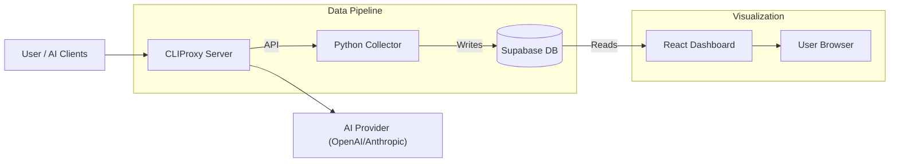

# CLIProxy Dashboard

Real-time monitoring dashboard for CLIProxy API usage - Track requests, tokens, costs, and OAuth credentials across all your AI models.


<p align="center">
  
</p>

## Features

- **Usage Analytics** - Track requests, tokens, success rates over time
- **Cost Estimation** - Calculate estimated API costs per model
- **Date Range Filters** - View Today, Yesterday, 7 Days, 30 Days, or All Time
- **Hourly Breakdown** - See usage patterns throughout the day
- **Model Breakdown** - Usage and cost per AI model
- **OAuth Credentials** - Monitor Antigravity, Codex, and Gemini CLI credentials with subscription status

---

## Quick Start (Production)

### Prerequisites

- [Docker](https://docs.docker.com/get-docker/) & Docker Compose
- [Supabase](https://supabase.com) account (free tier works)
- CLIProxy running with Management API enabled

### 1. Download Configuration

```bash
# Create project directory
mkdir cliproxy-dashboard && cd cliproxy-dashboard

# Download docker-compose.yml
curl -O https://raw.githubusercontent.com/leolionart/CLIProxyAPI-Dashboard/main/docker-compose.yml

# Download environment template
curl -O https://raw.githubusercontent.com/leolionart/CLIProxyAPI-Dashboard/main/.env.example
cp .env.example .env
```

### 2. Configure Environment

Edit `.env` with your credentials:

```env
# Supabase Configuration
SUPABASE_URL=https://xxxxx.supabase.co
SUPABASE_SECRET_KEY=eyJhbGciOiJIUzI1NiIsInR5cCI6IkpXVCJ9...

# CLIProxy Connection
CLIPROXY_URL=http://host.docker.internal:8317
CLIPROXY_MANAGEMENT_KEY=your-management-secret-key

# Optional Settings
COLLECTOR_INTERVAL_SECONDS=300
TIMEZONE_OFFSET_HOURS=7
```

### 3. Start Dashboard

```bash
docker compose up -d
```

### 4. Access Dashboard

Open your browser: **http://localhost:8417**

> First data will appear after ~5 minutes (first collection cycle)

---

## Updating

Pull the latest images and restart:

```bash
docker compose pull
docker compose up -d
```

---

## Configuration Reference

| Variable | Description | Default |
|----------|-------------|---------|
| `SUPABASE_URL` | Your Supabase project URL | Required |
| `SUPABASE_SECRET_KEY` | Supabase service role key | Required |
| `CLIPROXY_URL` | CLIProxy Management API URL | `http://host.docker.internal:8317` |
| `CLIPROXY_MANAGEMENT_KEY` | CLIProxy management secret | Required |
| `COLLECTOR_INTERVAL_SECONDS` | Polling interval | `300` (5 min) |
| `OAUTH_SYNC_INTERVAL_SECONDS` | OAuth credentials sync interval | `900` (15 min) |
| `TIMEZONE_OFFSET_HOURS` | Your timezone offset from UTC | `7` |

---

## Troubleshooting

### Check Logs

```bash
# All services
docker compose logs -f

# Collector only
docker compose logs -f collector

# Frontend only
docker compose logs -f frontend
```

### Common Issues

**Dashboard shows no data:**
- Wait 5 minutes for first data collection
- Check collector logs for connection errors
- Verify Supabase tables exist (see Initial Setup below)

**Collector can't connect to CLIProxy:**
- Ensure CLIProxy has `remote-management.allow-remote: true`
- Verify `CLIPROXY_MANAGEMENT_KEY` matches CLIProxy's secret
- Check CLIProxy is accessible from Docker (`host.docker.internal`)

---

<details>
<summary><h2>Initial Setup (First-time only)</h2></summary>

### Set Up Supabase

#### 1. Create a Supabase Project

1. Go to [supabase.com](https://supabase.com) and sign in
2. Click **New Project**
3. Choose your organization, name your project, set database password
4. Wait for project creation (~2 minutes)

#### 2. Create Database Tables

1. In Supabase, go to **SQL Editor** (left sidebar)
2. Click **New Query**
3. Paste and run the following SQL:

```sql
-- ============================================
-- CLIProxy Dashboard Database Schema
-- ============================================

-- Table for storing raw usage snapshots
CREATE TABLE IF NOT EXISTS usage_snapshots (
    id BIGSERIAL PRIMARY KEY,
    collected_at TIMESTAMPTZ NOT NULL DEFAULT NOW(),
    total_requests INTEGER NOT NULL DEFAULT 0,
    success_count INTEGER NOT NULL DEFAULT 0,
    failure_count INTEGER NOT NULL DEFAULT 0,
    total_tokens BIGINT NOT NULL DEFAULT 0,
    cumulative_cost_usd DECIMAL(10, 6) DEFAULT 0,
    raw_data JSONB
);

-- Table for storing per-model usage data
CREATE TABLE IF NOT EXISTS model_usage (
    id BIGSERIAL PRIMARY KEY,
    snapshot_id BIGINT REFERENCES usage_snapshots(id) ON DELETE CASCADE,
    api_endpoint VARCHAR(255) NOT NULL,
    model_name VARCHAR(255) NOT NULL,
    request_count INTEGER NOT NULL DEFAULT 0,
    input_tokens BIGINT NOT NULL DEFAULT 0,
    output_tokens BIGINT NOT NULL DEFAULT 0,
    total_tokens BIGINT NOT NULL DEFAULT 0,
    estimated_cost_usd DECIMAL(10, 6) DEFAULT 0,
    created_at TIMESTAMPTZ NOT NULL DEFAULT NOW()
);

-- Table for storing daily aggregated statistics
CREATE TABLE IF NOT EXISTS daily_stats (
    id BIGSERIAL PRIMARY KEY,
    stat_date DATE NOT NULL UNIQUE,
    total_requests INTEGER NOT NULL DEFAULT 0,
    success_count INTEGER NOT NULL DEFAULT 0,
    failure_count INTEGER NOT NULL DEFAULT 0,
    total_tokens BIGINT NOT NULL DEFAULT 0,
    estimated_cost_usd DECIMAL(10, 6) DEFAULT 0,
    breakdown JSONB DEFAULT '{}'::jsonb,
    updated_at TIMESTAMPTZ NOT NULL DEFAULT NOW()
);

-- Table for model pricing configuration
CREATE TABLE IF NOT EXISTS model_pricing (
    id BIGSERIAL PRIMARY KEY,
    model_pattern VARCHAR(255) NOT NULL UNIQUE,
    input_price_per_million DECIMAL(10, 4) NOT NULL,
    output_price_per_million DECIMAL(10, 4) NOT NULL,
    provider VARCHAR(50) NOT NULL DEFAULT 'unknown',
    updated_at TIMESTAMPTZ NOT NULL DEFAULT NOW()
);

-- Create indexes for performance
CREATE INDEX IF NOT EXISTS idx_usage_snapshots_collected_at ON usage_snapshots(collected_at DESC);
CREATE INDEX IF NOT EXISTS idx_model_usage_snapshot_id ON model_usage(snapshot_id);
CREATE INDEX IF NOT EXISTS idx_model_usage_model_name ON model_usage(model_name);
CREATE INDEX IF NOT EXISTS idx_daily_stats_date ON daily_stats(stat_date DESC);

-- Enable Row Level Security
ALTER TABLE usage_snapshots ENABLE ROW LEVEL SECURITY;
ALTER TABLE model_usage ENABLE ROW LEVEL SECURITY;
ALTER TABLE daily_stats ENABLE ROW LEVEL SECURITY;
ALTER TABLE model_pricing ENABLE ROW LEVEL SECURITY;
-- Create policies for read access
CREATE POLICY "Allow read access" ON usage_snapshots FOR SELECT USING (true);
CREATE POLICY "Allow read access" ON model_usage FOR SELECT USING (true);
CREATE POLICY "Allow read access" ON daily_stats FOR SELECT USING (true);
CREATE POLICY "Allow read access" ON model_pricing FOR SELECT USING (true);
-- Create policies for service role (Collector)
CREATE POLICY "Allow service insert" ON usage_snapshots FOR INSERT WITH CHECK (true);
CREATE POLICY "Allow service update" ON usage_snapshots FOR UPDATE USING (true);
CREATE POLICY "Allow service insert" ON model_usage FOR INSERT WITH CHECK (true);
CREATE POLICY "Allow service upsert" ON daily_stats FOR ALL USING (true);
CREATE POLICY "Allow service insert" ON model_pricing FOR INSERT WITH CHECK (true);
CREATE POLICY "Allow service update" ON model_pricing FOR UPDATE USING (true);
```

#### 3. Get Your API Keys

1. Go to **Settings** > **API** in Supabase
2. Copy these values:
   - **Project URL**: `https://xxxxx.supabase.co`
   - **service_role key**: Under "Project API keys" > "service_role" (click eye icon)

---

### Configure CLIProxy

Ensure your CLIProxy has Management API enabled:

```yaml
remote-management:
  allow-remote: true
  secret: "your-management-secret-key"
```

Note the `secret` value - use it as `CLIPROXY_MANAGEMENT_KEY` in your `.env`.

</details>

---

<details>
<summary><h2>Developer Guide</h2></summary>

### Local Frontend Development

```bash
cd frontend
npm install
npm run dev
```

Access at `http://localhost:5173` with hot reload.

### Local Collector Development

```bash
cd collector
python -m venv venv
source venv/bin/activate  # Windows: venv\Scripts\activate
pip install -r requirements.txt
python main.py
```

### Building Docker Images Locally

```bash
# Build from source
docker compose -f docker-compose.dev.yml build
docker compose -f docker-compose.dev.yml up -d
```

### Project Structure

```
cliproxy-dashboard/
├── collector/           # Python data collector
│   ├── main.py         # Collector logic
│   ├── Dockerfile
│   └── requirements.txt
├── frontend/           # React dashboard
│   ├── src/
│   │   ├── App.jsx
│   │   ├── components/
│   │   └── lib/
│   ├── Dockerfile
│   └── package.json
├── docker-compose.yml  # Production (GHCR images)
├── .env.example
└── README.md
```

</details>

---

<details>
<summary><h2>Dashboard Usage Guide</h2></summary>

### Date Range Tabs

| Tab | Description |
|-----|-------------|
| **Today** | Usage delta for current day only |
| **Yesterday** | Usage delta for previous day |
| **7 Days** | Total usage over past week |
| **30 Days** | Total usage over past month |
| **This Year** | Total usage for current year |

### Dashboard Sections

1. **Stats Cards** - Total requests, tokens, success rate
2. **Request Trends** - Line chart of requests over time
3. **Token Usage Trends** - Line chart of token consumption
4. **Cost Breakdown** - Pie chart of costs by model
5. **Model Usage** - Bar chart of requests per model
6. **API Keys** - Usage breakdown by API key
7. **Cost Details** - Detailed cost table by model

### Default Model Pricing (USD per 1M tokens)

| Model | Input | Output |
|-------|-------|--------|
| GPT-4o | $2.50 | $10.00 |
| GPT-4o-mini | $0.15 | $0.60 |
| Claude 3.5 Sonnet | $3.00 | $15.00 |
| Claude 4 Sonnet | $3.00 | $15.00 |
| Gemini 2.5 Flash | $0.15 | $0.60 |
| Gemini 2.5 Pro | $1.25 | $10.00 |

</details>

---

## Architecture



---

## License

MIT License - see [LICENSE](LICENSE) file for details

## Contributing

See [CONTRIBUTING.md](CONTRIBUTING.md) for guidelines.

## Support

If you find this project helpful, please give it a star!

For detailed setup, see the [Initial Setup](#initial-setup-first-time-only) section above.
