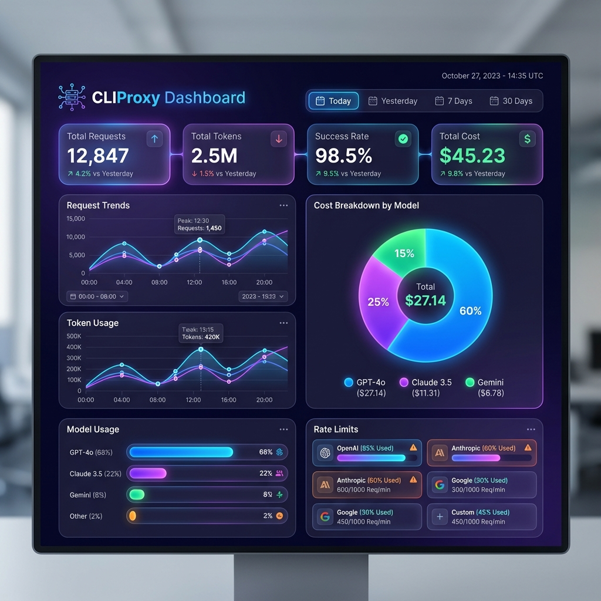

# CLIProxy Dashboard

Real-time dashboard for monitoring CLIProxy usage, token consumption, estimated cost, and credential health.

<p align="center">
  
</p>

## What this project includes

- **Collector (Python/Flask)**: polls CLIProxy Management API, computes deltas/costs, writes to PostgreSQL
- **Frontend (React + Nginx)**: charts and analytics UI
- **PostgreSQL**: self-hosted DB initialized from `init-db/schema.sql`
- **PostgREST**: read-only API layer for frontend
- **Skill tracker plugin distribution** via marketplace + submodule (`plugin/claude-skills-tracker`)

## Architecture

```text
CLIProxy API / CPA-Manager Usage Service → Collector (Python) → PostgreSQL
Browser → Nginx:8417
          ├── /rest/v1/*       → PostgREST:3000 → PostgreSQL (read)
          └── /api/collector/* → collector:5001 (write/trigger)
```

---

## Quick Start (run from this repository)

### 1) Prerequisites

- Docker + Docker Compose v2
- CLIProxy with remote management enabled

### 2) Configure CLIProxy Management API

Ensure your CLIProxy config includes:

```yaml
remote-management:
  allow-remote: true
  secret: "<your-management-secret>"
```

For CLIProxyAPI v6.10+ / v7, usage statistics are served by an external usage
service such as CPA-Manager. Keep the dashboard management URL pointed at
CLIProxyAPI, and point the usage URL at the usage service:

```yaml
usage-statistics-enabled: true
redis-usage-queue-retention-seconds: 3600
```

Quick verification:

```bash
curl -H "Authorization: Bearer <your-management-secret>" \
  http://localhost:18317/v0/management/usage
```

You should receive a JSON usage response. On older CLIProxyAPI versions that
still expose `/v0/management/usage`, `CLIPROXY_URL` and `CLIPROXY_USAGE_URL`
can be the same URL.

### 3) Clone and initialize submodule

```bash
git clone https://github.com/leolionart/CLIProxyAPI-Dashboard.git
cd CLIProxyAPI-Dashboard
git submodule update --init --recursive
```

### 4) Configure environment

```bash
cp .env.example .env
```

Edit `.env`:

```env
DB_PASSWORD=your_secure_password_here
CLIPROXY_URL=http://host.docker.internal:8317
# Optional: set this to CPA-Manager Usage Service for CLIProxyAPI v6.10+ / v7.
CLIPROXY_USAGE_URL=http://host.docker.internal:18317
CLIPROXY_MANAGEMENT_KEY=<your-management-secret>
ADMIN_PASSWORD=change-me

# Optional
COLLECTOR_INTERVAL_SECONDS=300
TIMEZONE_OFFSET_HOURS=7
ADMIN_SESSION_TTL_DAYS=30
ADMIN_SESSION_SECURE_COOKIE=false
ADMIN_SESSION_SAMESITE=Lax
```

Notes:
- Dashboard now requires admin login before loading UI or `/rest/v1/*` data.
- The browser stores only an `HttpOnly` session cookie; the password is never stored in browser storage.
- If you deploy behind HTTPS, set `ADMIN_SESSION_SECURE_COOKIE=true`.
- Default host port for PostgREST is now `8418` to avoid common conflicts on `3000`. Override with `POSTGREST_HOST_PORT` if needed.
- `ADMIN_ALLOWED_ORIGINS` is optional. Leave it empty for the default same-compose setup; set it only if you want stricter Origin/Referer enforcement.
- `CLIPROXY_URL` is used for CLIProxyAPI management endpoints such as auth files.
- `CLIPROXY_USAGE_URL` is used only for `/v0/management/usage`. For CPA-Manager, set it to the usage service URL.

### 5) Start services
```bash
docker compose up -d
```

Open dashboard at: **http://localhost:8417**

Expected startup order:
1. `postgres` healthy
2. `collector` healthy (DB init + migrations)
3. `postgrest` starts
4. `frontend` starts

> First data usually appears after the first collector interval.

---

<details>
<summary><h2>Verification</h2></summary>

```bash
docker compose ps
docker compose logs -f collector
curl -X POST http://localhost:8417/api/collector/trigger
```

Success signals:
- collector logs periodic snapshot collection
- collector health endpoint responds
- manual trigger returns success

</details>

---

<details>
<summary><h2>Alternative: deploy from raw compose files only</h2></summary>

If you don't want to clone the full repo:

```bash
mkdir cliproxy-dashboard && cd cliproxy-dashboard
curl -O https://raw.githubusercontent.com/leolionart/CLIProxyAPI-Dashboard/main/docker-compose.yml
curl -O https://raw.githubusercontent.com/leolionart/CLIProxyAPI-Dashboard/main/.env.example
cp .env.example .env
# then edit .env and run:
docker compose up -d
```

</details>

---

<details>
<summary><h2>Skill Tracker Plugin Setup</h2></summary>

Tracker plugin is now distributed from the shared Claude skills marketplace.

- **Marketplace repo:** `leolionart/claude-skills`
- **Plugin install ID:** `claude-skill-tracker`

Inside Claude Code:

```claude
/plugin marketplace add leolionart/claude-skills
/plugin install claude-skill-tracker
/reload-plugins
```

Optional endpoint override (if dashboard is not local):

```bash
export CLIPROXY_COLLECTOR_URL="https://your-domain/api/collector/skill-events"
```

**Dedupe note:** do not run both marketplace plugin hook and a manual `PostToolUse: Skill` hook at the same time.

</details>

<details>
<summary><h2>Codex Skill Tracking Hook</h2></summary>

Codex skill tracking is best-effort because Codex does not currently emit a dedicated `Skill` tool event. CLIProxyDash supports an inferred Stop hook that reads the Codex session JSONL and sends rows to the existing skill endpoint with `source=codex-hook`.

On every machine that should report Codex skill usage, run the one-step installer:

```bash
curl -fsSL \
  https://raw.githubusercontent.com/leolionart/CLIProxyAPI-Dashboard/main/scripts/setup_codex_tracking.py \
  | python3 - --collector-url "https://your-domain/api/collector/skill-events"
```

The installer downloads the hook script, creates a wrapper with the dashboard URL, enables `codex_hooks`, and appends the Stop hook without removing existing hooks.

Manual setup, if needed:

```bash
mkdir -p ~/.codex/hooks
curl -fsSL \
  https://raw.githubusercontent.com/leolionart/CLIProxyAPI-Dashboard/main/scripts/codex_skill_usage_hook.py \
  -o ~/.codex/hooks/codex_skill_usage_hook.py
chmod +x ~/.codex/hooks/codex_skill_usage_hook.py
```

Set the dashboard endpoint in the shell environment used to launch Codex:

```bash
export CLIPROXY_COLLECTOR_URL="https://your-domain/api/collector/skill-events"
```

Enable hooks in `~/.codex/config.toml`:

```toml
[features]
codex_hooks = true
```

Add this command to your Codex `Stop` hooks in `~/.codex/hooks.json`, preserving any existing Stop hooks:

```json
{
  "type": "command",
  "command": "python3 \"$HOME/.codex/hooks/codex_skill_usage_hook.py\"",
  "timeout": 10
}
```

Dry-run against a known session:

```bash
CLIPROXY_DRY_RUN=1 python3 ~/.codex/hooks/codex_skill_usage_hook.py <<'JSON'
{"session_path":"$HOME/.codex/sessions/YYYY/MM/DD/rollout-...jsonl"}
JSON
```

Current Codex coverage: this hook collects inferred skill usage only. It does not collect Codex sub-agent / agent lifecycle yet; that requires a separate Codex agent event pipeline, endpoint, and schema.

</details>

---

<details>
<summary><h2>Optional: Lark Suite MCP + local skill</h2></summary>

This repo now includes templates to enable Lark task data access from Claude Code.

### 1) Prepare local MCP config (do not commit secrets)

```bash
cp .mcp.json.example .mcp.json
```

`.mcp.json` is ignored by git in this repo, so keep real credentials there.

### 2) Set local environment variables

Use your shell profile (or export in current terminal):

```bash
export LARK_APP_ID="cli_xxx"
export LARK_APP_SECRET="your-lark-app-secret"
export LARK_DOMAIN="https://open.larksuite.com"
export LARK_TOOLSETS="preset.base,preset.task,task.v2.task.get,task.v2.task.list,task.v2.tasklist.list,task.v2.tasklist.tasks"
```

### 3) Reload Claude Code session

After saving `.mcp.json` and env vars, restart Claude Code (or reload) so `lark-mcp` can start.

### 4) Use repo-local skill

Skill file: `.claude/skills/lark-suite/SKILL.md`

Ask naturally, for example:
- "Lấy danh sách task đang open trong Lark"
- "Lấy chi tiết task theo ID ..."
- "Tóm tắt task theo trạng thái"

</details>

---

<details>
<summary><h2>Common operations</h2></summary>

### Update services

```bash
docker compose pull
docker compose up -d
```

### Health and smoke checks

```bash
docker compose ps
docker compose logs --tail=200 collector postgrest frontend
curl http://localhost:8417/api/collector/health
curl "http://localhost:8417/rest/v1/daily_stats?select=date,total_requests&order=date.desc&limit=1"
curl -X POST http://localhost:8417/api/collector/trigger
```

</details>

---

<details>
<summary><h2>Development</h2></summary>

### Frontend (hot reload)

`docker-compose.override.yml` is the local dev override and is loaded automatically by `docker compose`.
For source-only changes, prefer bind mounts + service restart. Rebuild images only when Dockerfile or dependencies changed.

```bash
docker compose up -d postgres postgrest
cd frontend
npm install
POSTGREST_HOST_PORT=8418 npm run dev
```

Open Vite dev UI at `http://localhost:5173`.

> Keep the local collector running too. Vite dev proxy now checks the same auth session flow as production, so `/rest/v1/*` stays locked until you log in.

### Collector (local)

```bash
cd collector
python -m venv venv
source venv/bin/activate   # Windows: venv\Scripts\activate
pip install -r requirements.txt
python main.py
```

</details>

---

<details>
<summary><h2>Troubleshooting</h2></summary>

### Collector cannot reach CLIProxy

- Check `remote-management.allow-remote: true` in CLIProxy config
- Ensure `CLIPROXY_MANAGEMENT_KEY` matches CLIProxy `secret`
- Ensure `CLIPROXY_URL` is reachable from the collector container

### Dashboard has no data

- Wait until first collection interval
- Check collector logs: `docker compose logs -f collector`
- Trigger manually after logging in: `curl -X POST http://localhost:8417/api/collector/trigger`

### Login does not work

- Ensure `.env` contains `ADMIN_PASSWORD` and that it matches what you enter on the login screen
- For HTTPS deployments, set `ADMIN_SESSION_SECURE_COOKIE=true`; for local HTTP keep it `false`
- If you use a custom origin or reverse proxy, set `ADMIN_ALLOWED_ORIGINS` to the public dashboard origin

### PostgREST errors about missing schema

- Confirm postgres is healthy before postgrest starts: `docker compose ps`
- If using an old pre-initialized volume, apply schema manually from `init-db/schema.sql`

### Port 3000 already allocated

- PostgREST now defaults to host port `8418` instead of `3000`
- If you want a different host port, set `POSTGREST_HOST_PORT` in `.env`
- If Vite dev is already running, restart it after changing `POSTGREST_HOST_PORT`

</details>

---

<details>
<summary><h2>Key paths</h2></summary>

- `collector/main.py` – collector + Flask endpoints
- `collector/db.py` – PostgreSQL client + migrations runner
- `collector/migrations/` – DB migrations (required for schema changes)
- `frontend/src/` – dashboard UI
- `plugin/claude-skills-tracker/` – tracker plugin submodule (source mirror for dashboard development)
- Tracker marketplace source of truth: `leolionart/claude-skills`

</details>

---

## License

MIT — see [LICENSE](LICENSE).
