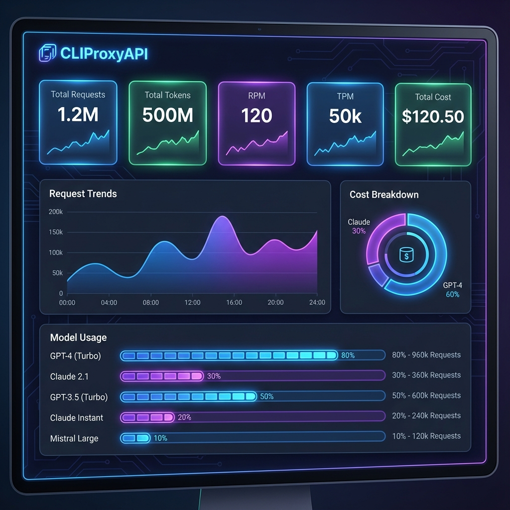
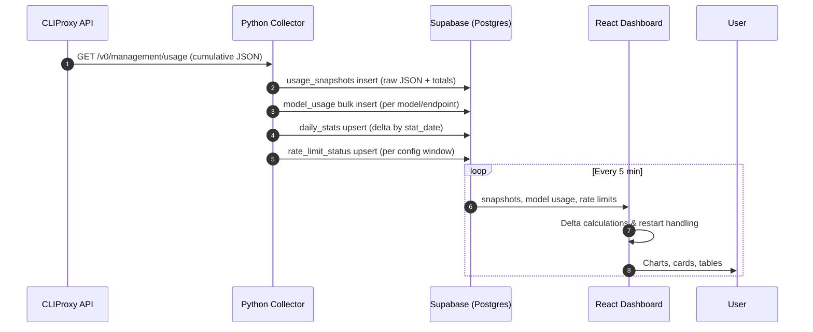
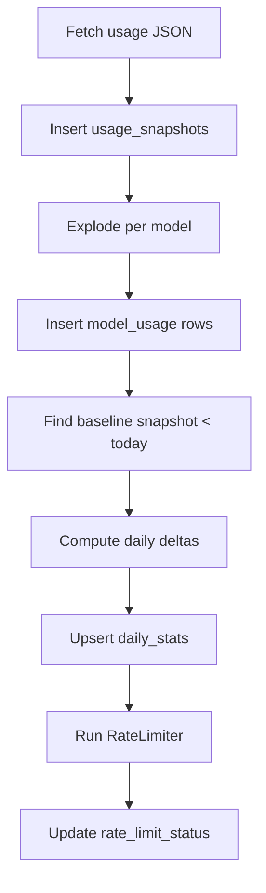
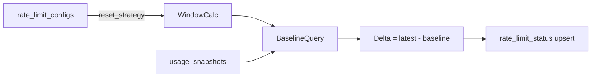
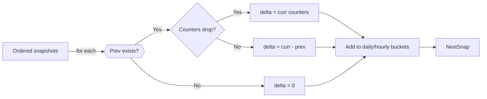
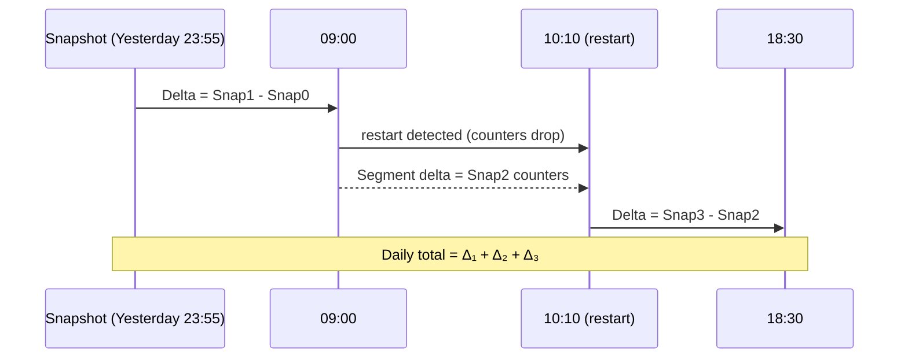
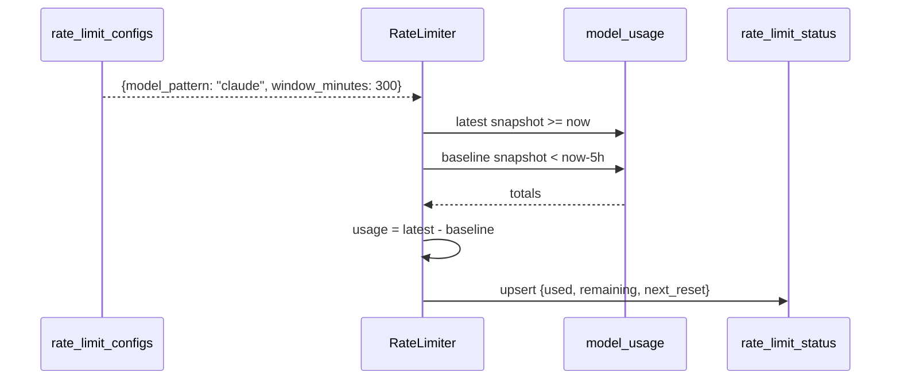

# Dashboard Data & Logic Documentation

*Figure 1: Visual overview of the CLIProxy Dashboard interface.*

This guide walks through every hop in the pipeline—from CLIProxy to Supabase to each dashboard widget—so the reasoning behind every metric is transparent.

## 1. End-to-End Flow

### 1.1 Data Journey

**Key Insight:** CLIProxy only emits cumulative counters. All time-range intelligence ("Today", "7 Days") is derived from subtracting earlier snapshots rather than relying on pre-aggregated views.

### 1.2 Supabase Table Map

| Table | Purpose | Producer | Consumers |
| --- | --- | --- | --- |
| `usage_snapshots` | Raw cumulative stats + `raw_data` | Collector (`collector/main.py:275-323`) | Frontend hourly/daily reducers, rate limiter baselines |
| `model_usage` | Per model + endpoint breakdown with estimated cost | Collector (`collector/main.py:300-323`) | Model bars, API key chart, cost table |
| `daily_stats` | Daily deltas (requests, tokens, costs) | Collector (`collector/main.py:324-364`) | Stats cards, daily charts |
| `model_pricing` | Override pricing patterns | Admin / NocoDB | Collector pricing lookup |
| `rate_limit_configs` | Provider/tier limits + reset strategy | Admin / NocoDB | Rate limiter, rate limit UI |
| `rate_limit_status` | Remaining quota snapshot | RateLimiter (`collector/rate_limiter.py:278-324`) | RateLimitCard |

## 2. Collector Deep Dive

### 2.1 Processing Flow

1. **Fetch** – `fetch_usage_data()` pulls `/v0/management/usage` with the management key (`collector/main.py:242-252`).
2. **Persist Snapshot** – `usage_snapshots` stores raw JSON for audit + cumulative fields (line 290).
3. **Explode Models** – Each `api_endpoint`/`model_name` pair becomes a `model_usage` row with aggregated `request_count`, `total_tokens`, and cost (lines 301-323).
4. **Daily Delta** – Determine local midnight (`TIMEZONE_OFFSET_HOURS`) and subtract the last snapshot before that point to obtain per-day usage (lines 324-355).
5. **Restart Protection** – `max(0, delta)` clamps negative results so counter resets don’t produce negative stats (lines 350-353).
6. **Rate Limits** – `RateLimiter.sync_limits()` computes sliding-window deltas using the same snapshot tables, honors manual reset anchors, and upserts `rate_limit_status` (rate_limiter.py:21-324).

### 2.2 Pricing Stack

1. Try remote JSON feed (`https://www.llm-prices.com/current-v1.json`).
2. Merge with Supabase overrides (`model_pricing`).
3. Fall back to `DEFAULT_PRICING` in `collector/main.py:51-86`.

This guarantees that every `model_usage` row stores a contemporaneous `estimated_cost_usd`, so frontend cost charts never have to re-run pricing logic.

### 2.3 Rate Limit Window Logic

- **Window Start:** per strategy (`daily`, `weekly`, `rolling`). Manual resets store a `reset_anchor_timestamp`; if it’s newer than the natural start it overrides the window until the next calendar boundary.
- **Baseline:** latest snapshot before the window. If a gap >30 minutes is detected, the first in-window snapshot becomes the baseline to avoid importing stale usage (rate_limiter.py:196-213).
- **Status Payload:** `used_tokens`, `remaining_tokens`, `percentage`, `window_start`, `next_reset` updated atomically.

## 3. Frontend Data Shaping

### 3.1 Date Boundary Helper

`getDateBoundaries()` (App.jsx:7-80) converts the selected range into:
- `startDate` / `endDate` (YYYY-MM-DD local) for `daily_stats`.
- `startTime` / `endTime` (UTC ISO) for `usage_snapshots` queries.

### 3.2 Snapshot Reducer

- **Hourly stats**: increments grouped by hour-of-day for request/token sparklines (App.jsx:133-195).
- **Daily stats**: increments grouped by local date for multi-day charts and cards (App.jsx:149-182).
- **Restart detection**: `curr < prev` triggers “reset segment” logic ensuring each day’s total is `segment₁ + segment₂ + …` instead of just the last stretch.

### 3.3 Model vs Endpoint Aggregation

1. **Single-day ranges** – Identify “critical” snapshots (baseline + pre-reset peaks + final) and compare model counters segment by segment (App.jsx:208-316).
2. **Multi-day ranges** – Split snapshots into day buckets, take `last - first` per day (with restart fallback), then sum the resulting maps (App.jsx:318-450).
3. **Final outputs** –
   - `modelUsage`: grouped by `model_name` for model charts & cost table.
   - `endpointUsage`: grouped by `api_endpoint` (API key) for the API key chart.

## 4. Dashboard Component Matrix

| UI Widget | Data Hook | Source Tables | Notes |
| --- | --- | --- | --- |
| Stats cards | `dailyStats`, `modelUsage`, `hourlyStats` | `usage_snapshots`, `model_usage`, `daily_stats` | RPM/TPM derived from total minutes in range; sparklines use last 12 hourly bins. |
| Request trends | `hourlyStats` or `dailyStats` | `usage_snapshots` | Toggles hour/day; defaults to hour for Today/Yesterday. |
| Token trends | Same as request trends | `usage_snapshots` | Uses `total_tokens` deltas. |
| Cost breakdown pie | `modelUsage` | `model_usage` | Brand colors resolved via keyword mapping (Dashboard.jsx:13-78). |
| Model usage bar | `stackedModelData` | `model_usage` | Bars sized by request count; height auto-expands per model quantity. |
| API keys bar | `endpointUsage` | `model_usage` | Labels show `requests | $cost`. |
| Cost table | `costBreakdown` | `model_usage` | Sortable columns; totals row sums all metrics. |
| Rate limit card | `loadRateLimitsConfig()` | `rate_limit_configs`, `rate_limit_status` | Auto-refresh every 30s; reset button hits `/api/collector/reset/:id`. |

## 5. Flow Illustrations

### 5.1 “Today” Calculation Example

### 5.2 Rate Limit Window Example

## 6. Operational Notes

- **Timezone alignment:** Collector and frontend both respect `TIMEZONE_OFFSET_HOURS`, so queries always slice days at local midnight even though Supabase stores UTC timestamps.
- **Manual collector trigger:** Refresh button hits `/api/collector/trigger` (App.jsx:562-617) to run an out-of-band fetch + rate limit sync.
- **Manual rate limit reset:** Dashboard reset button calls `/api/collector/reset/:config_id`, which zeroes `rate_limit_status` and sets a `reset_anchor_timestamp` so the next sync honors the manual window.
- **Quản trị cấu hình:** Các biểu mẫu cấu hình nằm ngay trên dashboard (ví dụ cập nhật rate limit trực tiếp trong giao diện) và mọi thay đổi được ghi thẳng vào Supabase; không có thêm lớp quản lý riêng hay NocoDB.

---

By following this flow, anyone auditing the system can trace a number on the dashboard all the way back to the raw CLIProxy counters and understand how restarts, pricing overrides, and sliding windows are factored into the final visuals.
