# Data Calculation Challenges and Solutions

This document describes the technical challenges faced when calculating usage statistics from CLIProxy snapshots, and the solutions implemented.

## Background

CLIProxy Dashboard collects periodic snapshots of API usage from CLIProxy. Each snapshot contains cumulative counters (requests, tokens, cost) for each model and API endpoint. The dashboard needs to calculate **actual usage** within specific date ranges (Today, Yesterday, 7 Days, etc.).

## Core Challenges

### Challenge 1: Cumulative vs Delta Data

**Problem:** CLIProxy reports cumulative values, not per-period increments. A snapshot showing `cost=$25.50` means $25.50 total since CLIProxy started, not $25.50 in the current period.

**Failed Approaches:**
- Using raw snapshot values directly → Shows total since start, not period usage
- Using latest snapshot only → Same problem

**Solution: DELTA Calculation**
```
period_usage = last_snapshot_value - first_snapshot_value
```

For a date range, compare the first and last snapshot to get the delta (actual usage within that period).

---

### Challenge 2: CLIProxy Restarts

**Problem:** When CLIProxy restarts, all counters reset to 0. This causes:
- Negative deltas (last < first)
- Lost data if only comparing first/last snapshots

**Scenario:**
```
Snapshot 100: claude cost = $25.50 (before restart)
Snapshot 101: claude cost = $0.00  (after restart)
Snapshot 200: claude cost = $8.14  (current)

Delta = $8.14 - $25.50 = -$17.36 (WRONG!)
```

**Failed Approaches:**
- Using MAX across all snapshots → Ignores usage after restart
- Simple negative delta check with fallback to last value → Works for single-day ranges only

**Solution: Segment-based Calculation**

```mermaid
graph LR
    subgraph "Session 1 (Before Restart)"
        S1["Snapshot 100\nCost: $25.50"]
    end

    subgraph "Restart Event"
        R["💥 RESTART 💥\nCounters Reset to 0"]
    end

    subgraph "Session 2 (After Restart)"
        S2["Snapshot 101\nCost: $0.00"] -- Usage Grows --> S3["Snapshot 200\nCost: $8.14"]
    end

    S1 -.-> R -.-> S2

    calc["Total Usage Calculation"]
    
    S1 -- "Peak Value ($25.50)" --> calc
    S3 -- "Current Value ($8.14)" --> calc
    
    calc -- "Sum = Peak + Current" --> Result["Total: $33.64"]
```



1. **Detect restart:** Cost drops by >50% between consecutive samples
2. **Find peak snapshot:** The snapshot with highest total cost before the drop
3. **Sum segments:**
   ```
   total_usage = (peak - first) + (last_after_restart)
   ```

This captures usage BEFORE restart AND usage AFTER restart.

---

### Challenge 3: Multi-day Ranges Don't Equal Sum of Days

**Problem:** `7_Days ≠ Yesterday + Today` even with only 2 days of data.

**Root Cause:** 
- Single-day ranges (Today, Yesterday) use DELTA per day
- Multi-day ranges were using DELTA across entire range, missing mid-range restarts

**Scenario:**
```
Yesterday: first=$0, last=$36 → delta = $36
Today:     first=$0, last=$8  → delta = $8
Expected 7 Days: $36 + $8 = $44

7 Days (wrong): first(day1)=$0, last(day2)=$8 → delta = $8
(Ignores yesterday's $36 because it was before restart!)
```

**Solution: Sum of Daily Deltas**

```mermaid
graph TD
    subgraph "Incorrect Approach (Range Delta)"
        RangeStart["Day 1 Start ($0)"] --> RangeEnd["Day 2 End ($8)"]
        RangeEnd -- "Delta = $8 - $0" --> WrongResult["Result: $8 ❌"]
    end

    subgraph "Correct Approach (Sum of Dailies)"
        D1Start["Day 1 Start ($0)"] --> D1End["Day 1 Peak ($36)"]
        D1End -- "Delta 1: $36" --> Sum
        
        Restart["Restart Event"]
        
        D2Start["Day 2 Start ($0)"] --> D2End["Day 2 End ($8)"]
        D2End -- "Delta 2: $8" --> Sum
        
        Sum["Sum Deltas"] --> CorrectResult["Result: $44 ✅"]
    end
```



For multi-day ranges:
1. Split snapshots by day
2. Calculate DELTA for each day independently
3. Sum all daily deltas

```javascript
for (day of days_in_range) {
    day_delta = calc_delta(day.first_snapshot, day.last_snapshot)
    total += day_delta
}
```

---

### Challenge 4: Missing API Endpoints

**Problem:** Only 2 of 4 API keys appear in the dashboard, even though database contains all 4.

**Root Cause:** Data was keyed only by `model_name`. However:
- Same model can be accessed via different API endpoints
- Endpoints that only exist in peak snapshot (before restart) but not in first/last get lost

**Example:**
```
First snapshot: endpoints = {n8n, local-proxy-key}
Peak snapshot:  endpoints = {n8n, n8n-shared, sk-dummy, local-proxy-key}
Last snapshot:  endpoints = {local-proxy-key}

Result: Only local-proxy-key shows up!
```

**Solution: Key by Model+Endpoint Combo**

Changed all Map keys from `model_name` to `model_name|||api_endpoint`:

```javascript
const makeKey = (m) => `${m.model_name}|||${m.api_endpoint || 'default'}`
```

This preserves each unique model+endpoint combination across all snapshots.

---

### Challenge 5: Intra-day Restarts for Single-day Ranges

**Problem:** If CLIProxy restarts WITHIN the same day, simple DELTA misses pre-restart usage.

**Scenario (Today):**
```
00:00 - snapshot_a: claude = $23.98 (baseline from yesterday's session)
02:00 - snapshot_b: claude = $25.50 (peak before restart)
03:00 - CLIProxy restarts, counters reset
08:00 - snapshot_c: claude = $8.14 (current)

Simple DELTA: $8.14 - $23.98 = negative → fallback to $8.14
Correct: ($25.50 - $23.98) + $8.14 = $1.52 + $8.14 = $9.66
```

**Solution: Peak Detection for Single Days**


For single-day ranges:
1. Sample snapshots to find total cost at each point
2. Detect if restart occurred (cost drop > 50%)
3. If restart detected:
   - Find peak snapshot (highest cost before drop)
   - Calculate: `(peak - first) + last`
4. If no restart: Use simple DELTA

---

## Summary of Current Implementation

| Range Type | Calculation Method |
|------------|-------------------|
| **Today/Yesterday** | Segment-based: detect restart, sum (peak-first) + last |
| **7 Days/30 Days/All** | Sum of daily deltas: calculate delta per day, then sum |
| **Key Strategy** | `model_name|||api_endpoint` combo to track all endpoints |

## Code Locations

- **Main calculation logic:** `frontend/src/App.jsx` (lines 195-475)
- **API Keys chart:** `frontend/src/components/Dashboard.jsx` (endpointUsage useMemo)
- **Database tables:** `usage_snapshots`, `model_usage` (Supabase)

## Testing Recommendations

1. **After CLIProxy restart:** Verify Today shows both pre- and post-restart usage
2. **7 Days = Yesterday + Today:** When only 2 days of data exist, totals should match
3. **All API keys visible:** Check API Keys chart shows all endpoints used
4. **Cross-day comparison:** Switch between Today/Yesterday/7 Days and verify consistency
